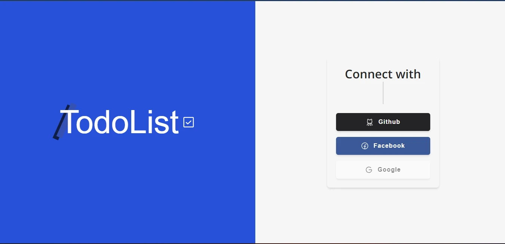

<h1 align="center">
  <strong>TodoList</strong>
</h1>

<p align="center">
🗣👥 Projeto com CRUD do TODOS utilizando NextJS + Prisma + Next-Auth
</p>

## 🎨 Screen




<h3 align="center">

</h3>

## ✅ About

- Projeto feito com intuito de aprimorar meus conhecimento em React, NextJS, SASS, Prisma.

- Apesar de ser um projeto simples de adicionar, remover, deletar, atualizar to do, exige um alto conhecimento em gerenciamente de estados, requisições da api, serveless, prisma e banco de dados.

- Para fazer chamadas a api utilizei React Query, que nunca tinha atualizado, mas para esse projeto achei perfeito pela sua simplicidade e poder de manipulação de dados assíncrono.

- Para autenticação foi usada a lib next-auth usando os provedores do github e facebook para o usuário de conectar e poder ter acesso a rota **/tasks**.

## 🧰 Tools

- [React](https://reactjs.org/)
- [NextJS](https://nextjs.org/)
- [SASS](https://sass-lang.com/)
- [ReactQuery](https://tanstack.com/query/v4/?from=reactQueryV3&original=https://react-query-v3.tanstack.com/)
- [Prisma](https://www.prisma.io/)
- [Next-auth](https://next-auth.js.org/)

## Install

```
$ git clone https://github.com/joaojustodev/todo-list

$ cd todo-list

$ yarn install

```

- Configure o arquivo .env

```
  .env
    - DATABASE_URL=mysql://...
    - NEXTAUTH_URL=http://localhost:300
    - NEXTAUTH_SECRET=SECRET
    - GITHUB_ID=
    - GITHUB_SECRET=
```

    **FACEBOOK PROVIDER DONT RUN IN LOCALHOST**

## 🙋‍♂️ Author

- **João Vitor** - [JoaoJustoDev](https://github.com/joaojustodev)
